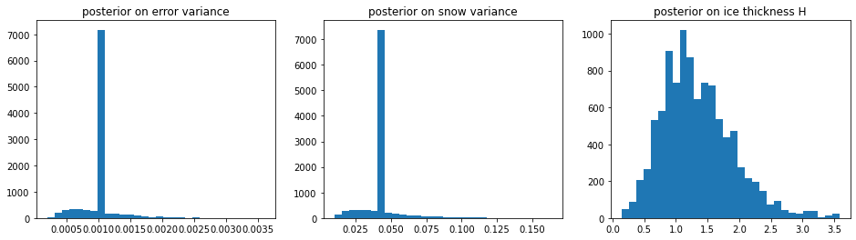

# Bayesian Modeling of Polar Sea Ice Thickness

### Jeff Liu, August 2020

In this project, I conducted Bayesian inference of sea ice thickness given a freeboard measurement from IceSat-2 satellite data.
Coupled with a physical model incorporating the local densities of water, snow, and ice with the relationship between freeboard,
ice thickness, and snow thickness, I computed a posterior on the ice thickness that generated a freeboard measurement of ten centimeters.
In this process, I also used a hierarchical model to approximate the margin of error of IceSat-2's measurements. 

To compute this non-conjugate, non-linear, analytically intractable posterior, I used the Metropolis-within-Gibbs technique with Markov Chain
Monte Carlo to sample from the distribution. With this technique, I found the following marginal posterior distributions, and estimated an
ice thickness of 1.34 meters with a standard deviation of 0.55 meters representing the remaining Bayesian uncertainty.

For details, see the project paper and the Jupyter notebook. Note: I have observed that the Jupyter notebook sometimes does not render
properly on GitHub. If GitHub isn't rendering it right, go to https://nbviewer.jupyter.org/github/jeffzyliu/bayesian-sea-ice/blob/master/IceThickness.ipynb
which will definitely provide a better render.

> "Went above and beyond the level of problems we discussed... This is one of the best projects in the class."
- [Dr. Matthew Parno](http://mparno.mit.edu), Adjunct Prof. @ Dartmouth, MATH 76: Introduction to Bayesian Computation

